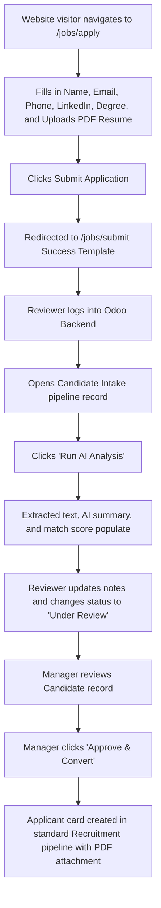

# User Journey & Data Flow: Candidate Intake Pipeline

This document provides a comprehensive walkthrough of the user and data journeys through the custom Odoo 17 Candidate Intake module.

---

## 1. The User Journey (Step-by-Step UI Flow)



### Step 1: Frontend Application Entry
- **User Interface:** The visitor navigates to the public route `/jobs/apply` (defined in [main.py](file:///c:/odoo_learning/addons/candidate_Intake/controllers/main.py#L7)). They are presented with a clean web layout containing inputs for Name, Email, Phone, LinkedIn Profile, Degree, and a file selector for the PDF resume.
- **Trigger:** Filling in mandatory fields and clicking "Submit Application".

### Step 2: Confirmation
- **User Interface:** The user is redirected to the `/jobs/submit` success page (defined in [website_form.xml](file:///c:/odoo_learning/addons/candidate_Intake/views/website_form.xml#L53)), thanking them for their application.

### Step 3: Backend Review & AI Parsing
- **User Interface:** An Odoo Reviewer logs into the backend backend, opens the **Candidate Intake** menu, and clicks on the newly created record. 
- **Trigger:** The reviewer clicks the "Run AI Analysis" button (defined in [candidate_intake_views.xml](file:///c:/odoo_learning/addons/candidate_Intake/views/candidate_intake_views.xml#L28)). The raw PDF content is extracted, showing up in the "Resume Text" notebook tab, and the AI Match Score and AI Summary are displayed.
- **Action:** The reviewer edits "Reviewer Notes" and clicks "Start Review", transitioning the state indicator from **New** to **Under Review**.

### Step 4: Manager Conversion
- **User Interface:** An Odoo Manager views the candidate record.
- **Trigger:** The Manager clicks the "Approve & Convert" button (defined in [candidate_intake_views.xml](file:///c:/odoo_learning/addons/candidate_Intake/views/candidate_intake_views.xml#L31)). 
- **Outcome:** The record status changes to **Approved**, the candidate's details are migrated, and a new card appears in Odoo's default Recruitment pipeline.

---

## 2. The Data Journey (Under the Hood)

### Phase A: Submission & Storage
1. **Frontend Collection:**
   The form uses `enctype="multipart/form-data"` in [website_form.xml](file:///c:/odoo_learning/addons/candidate_Intake/views/website_form.xml#L7) to allow binary stream transmissions.
2. **Controller Processing (`controllers/main.py`):**
   - The `intake_submit` method captures fields.
   - It retrieves the file object: `request.httprequest.files.get('resume_file')`.
   - It decodes the binary file and encodes it to base64: `base64.b64encode(file_upload.read())`.
3. **Database Write:**
   - Creates a new record in `hr.candidate.intake` using `sudo()` (anonymous bypass) with the fields `linkedin_url`, `degree`, `resume_file`, and `resume_filename`.

### Phase B: Extraction & AI Parsing (`models/candidate_intake.py`)
1. **Text Extraction:**
   - `action_analyze_resume` is called.
   - If `resume_file` is set, `base64.b64decode` transforms it back into binary.
   - `PyPDF2.PdfReader` parses the bytes stream:
     ```python
     pdf_reader = PyPDF2.PdfReader(pdf_file)
     for page in pdf_reader.pages:
         text += (page.extract_text() or "")
     ```
   - The result is written directly to `resume_text`.
2. **Groq AI Querying:**
   - A structured request is sent to `https://api.groq.com/openai/v1/chat/completions` using the API Key retrieved from `ir.config_parameter`.
   - The model `llama-3.1-8b-instant` processes the request and responds in JSON format: `{"summary": "...", "score": 85}`.
   - The response is parsed and written to `ai_summary` and `ai_score`.

### Phase C: Recruitment Pipeline Injection (`models/candidate_intake.py`)
1. **Degree Resolution:**
   - On `action_approve`, Odoo looks for an existing matching record in `hr.recruitment.degree` using:
     ```python
     self.env['hr.recruitment.degree'].sudo().search([('name', '=ilike', record.degree.strip())])
     ```
   - If not found, it creates one.
2. **Applicant Creation:**
   - Creates a new `hr.applicant` record, passing `linkedin_profile` and `type_id` (Degree).
3. **Attachment Linkage:**
   - Creates an `ir.attachment` record pointing to the `hr.applicant` model with `datas=record.resume_file` and `res_id=new_applicant.id`. This attaches the resume directly to the recruitment pipeline card.
4. **Status Promotion:**
   - Writes `status='approved'` and stores the relation link in `applicant_id` to prevent double-conversion.
