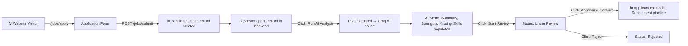

# User Journey & Data Flow: Candidate Intake Pipeline

This is the complete Project Handbook — every screen, action, state, and line of code that data passes through, explained in both plain English and technical detail.

---

## Overview Diagram



---

## Part 1: The User Journey (Screen by Screen)

### Screen 1 — The Public Application Form

**URL:** `http://localhost:8069/jobs/apply`
**Who sees it:** Any anonymous website visitor (public user)
**What's on screen:**

| Field | Type | Required | Notes |
|-------|------|----------|-------|
| Full Name | text | ✅ | Maps to `name` |
| Email | email | ✅ | Maps to `email` |
| Phone | text | ❌ | Maps to `phone` |
| Position | dropdown | ✅ | Populated from `hr.job` records, maps to `job_id` |
| LinkedIn Profile | text | ❌ | Maps to `linkedin_url` |
| Degree | text | ❌ | Maps to `degree` |
| Resume File | file (.pdf/.doc/.docx) | ✅ | Maps to `resume_file` + `resume_filename` |

**Technical:** The form uses `enctype="multipart/form-data"` to support binary file uploads. A hidden `csrf_token` field prevents cross-site request forgery. Defined in [website_form.xml](file:///c:/odoo_learning/addons/candidate_Intake/views/website_form.xml#L7-L44).

---

### Screen 2 — Submission Confirmation

**URL:** `http://localhost:8069/jobs/submit` (POST redirect)
**What's on screen:** A simple "Thank You!" message with a "Return to Home" button.
**Technical:** Rendered by template `apply_success_template` in [website_form.xml](file:///c:/odoo_learning/addons/candidate_Intake/views/website_form.xml#L49-L57).

---

### Screen 3 — Backend List View (Reviewer/Manager)

**Location:** Odoo Backend → Recruitment → Candidate Intake
**What's on screen:** A table listing all submitted candidates with columns: Name, Job Position, Source, and Status (displayed as colored badges).
**Technical:** Tree view defined in [candidate_intake_views.xml](file:///c:/odoo_learning/addons/candidate_Intake/views/candidate_intake_views.xml#L5-L19). Menu item is nested under `hr_recruitment.menu_hr_recruitment_root`.

---

### Screen 4 — Backend Form View (The Main Workspace)

**What's on screen when a record is opened:**

**Header bar:**
- **"Run AI Analysis"** button — always visible
- **"Start Review"** button — visible only when status is `new`
- **"Approve & Convert"** button — visible only when status is `review`, restricted to Manager group
- **"Reject"** button — visible only when status is `review`
- **Status bar** — visual state indicator: New → Under Review → Approved / Rejected

**Top-right stat box:** AI Match Score displayed as `XX/100` inside a star icon button.

**Main body (two-column layout):**

| Left Column | Right Column |
|-------------|-------------|
| Candidate Name | Target Job Position |
| Email | Source |
| Phone | Linked Applicant (shown only after conversion) |
| LinkedIn Profile (clickable URL widget) | Resume Filename (hidden helper) |
| Degree | Resume File (download widget) |

**Notebook tabs:**
- **"Resume & AI Analysis"** tab: Resume Text (extracted), AI Summary, Top Strengths, Missing Skills
- **"Reviewer Notes"** tab: Free-text notes field

**Chatter section** (below the sheet): Message followers, Activities, and Message log — tracking changes to `name`, `email`, and `status`.

**Technical:** Form view defined in [candidate_intake_views.xml](file:///c:/odoo_learning/addons/candidate_Intake/views/candidate_intake_views.xml#L22-L82).

---

## Part 2: The Data Journey (Code-Level Trace)

### Phase A: Submission → Database

```
Browser (multipart POST) → /jobs/submit → intake_submit() → hr.candidate.intake.create()
```

**Step-by-step:**

1. **Browser** sends a multipart/form-data POST to `/jobs/submit`.
2. **Controller** [main.py:16](file:///c:/odoo_learning/addons/candidate_Intake/controllers/main.py#L16) — `intake_submit()` is invoked.
3. **File capture** [main.py:18](file:///c:/odoo_learning/addons/candidate_Intake/controllers/main.py#L18) — `request.httprequest.files.get('resume_file')` retrieves the raw file stream from Werkzeug.
4. **Base64 encoding** [main.py:22](file:///c:/odoo_learning/addons/candidate_Intake/controllers/main.py#L22) — `base64.b64encode(file_upload.read())` converts the binary file to a base64 string suitable for Odoo's Binary field.
5. **Record creation** [main.py:26-36](file:///c:/odoo_learning/addons/candidate_Intake/controllers/main.py#L26-L36) — `sudo().create()` bypasses ACL (public user has no write access) and inserts a row into `hr_candidate_intake` with all mapped fields. The `source` is hardcoded to `'other'` for web submissions.

---

### Phase B: PDF Extraction → AI Analysis

```
resume_file (base64) → base64.b64decode → BytesIO → PyPDF2.PdfReader → resume_text → Groq API → ai_summary + ai_score + ai_strengths + ai_missing_skills
```

**Step-by-step (triggered by "Run AI Analysis" button):**

1. **PDF detection** [candidate_intake.py:105](file:///c:/odoo_learning/addons/candidate_Intake/models/candidate_intake.py#L105) — checks if `resume_file` binary field has data.
2. **Decode** [candidate_intake.py:110](file:///c:/odoo_learning/addons/candidate_Intake/models/candidate_intake.py#L110) — `base64.b64decode(record.resume_file)` converts from base64 back to raw PDF bytes.
3. **Stream wrap** [candidate_intake.py:111](file:///c:/odoo_learning/addons/candidate_Intake/models/candidate_intake.py#L111) — `io.BytesIO(pdf_bytes)` creates an in-memory file-like object.
4. **Text extraction** [candidate_intake.py:112-115](file:///c:/odoo_learning/addons/candidate_Intake/models/candidate_intake.py#L112-L115) — `PyPDF2.PdfReader` iterates through `.pages` and calls `page.extract_text()` on each page. The concatenated text is written to `resume_text`.
5. **Validation** [candidate_intake.py:121-122](file:///c:/odoo_learning/addons/candidate_Intake/models/candidate_intake.py#L121-L122) — raises `UserError` if no text was extracted (e.g., image-only PDF or no file uploaded).
6. **API key check** [candidate_intake.py:124-126](file:///c:/odoo_learning/addons/candidate_Intake/models/candidate_intake.py#L124-L126) — reads `candidate_intake.groq_api_key` from `ir.config_parameter`. Raises a clear error if missing.
7. **Prompt construction** [candidate_intake.py:131-155](file:///c:/odoo_learning/addons/candidate_Intake/models/candidate_intake.py#L131-L155) — builds a structured prompt with a weighted 4-criteria rubric (Skill Match 35pts, Relevant Experience 35pts, Measurable Impact 20pts, Professionalism 10pts) and strict scoring bands. Requests JSON output with `summary`, `score`, `strengths`, and `missing` fields.
8. **API call** [candidate_intake.py:170](file:///c:/odoo_learning/addons/candidate_Intake/models/candidate_intake.py#L170) — `requests.post()` sends the payload to Groq with a 15-second timeout.
9. **Response parsing** [candidate_intake.py:176-185](file:///c:/odoo_learning/addons/candidate_Intake/models/candidate_intake.py#L176-L185) — extracts the JSON content string from `choices[0].message.content`, parses it with `json.loads()`, and writes the four AI fields back to the record.

---

### Phase C: Approval → Recruitment Pipeline

```
hr.candidate.intake → hr.recruitment.degree (find or create) → hr.applicant.create() → ir.attachment.create()
```

**Step-by-step (triggered by "Approve & Convert" button):**

1. **Guard checks** [candidate_intake.py:62-65](file:///c:/odoo_learning/addons/candidate_Intake/models/candidate_intake.py#L62-L65) — validates status is `review` and no prior applicant link exists.
2. **Degree resolution** [candidate_intake.py:68-73](file:///c:/odoo_learning/addons/candidate_Intake/models/candidate_intake.py#L68-L73) — performs a case-insensitive search (`=ilike`) on `hr.recruitment.degree` for the candidate's degree string. Creates a new degree record if none found. This maps to the standard Odoo `type_id` field on `hr.applicant`.
3. **Applicant creation** [candidate_intake.py:75-86](file:///c:/odoo_learning/addons/candidate_Intake/models/candidate_intake.py#L75-L86) — creates a new `hr.applicant` record with:
   - `partner_name` / `email_from` / `partner_phone` — contact info
   - `job_id` — the target position
   - `linkedin_profile` — mapped from `linkedin_url`
   - `type_id` — the resolved degree
   - `description` — compiled AI score, summary, and reviewer notes
4. **Resume attachment** [candidate_intake.py:89-95](file:///c:/odoo_learning/addons/candidate_Intake/models/candidate_intake.py#L89-L95) — creates an `ir.attachment` record pointing to the new applicant (`res_model='hr.applicant'`, `res_id=new_applicant.id`), copying the resume binary data. This makes the PDF visible in the Recruitment pipeline's attachment panel.
5. **Status update** [candidate_intake.py:97-100](file:///c:/odoo_learning/addons/candidate_Intake/models/candidate_intake.py#L97-L100) — writes `status='approved'` and stores the `applicant_id` foreign key to prevent duplicate conversions.
